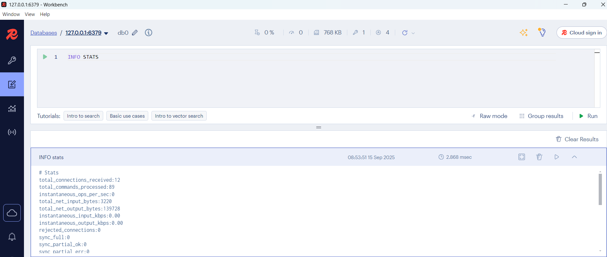
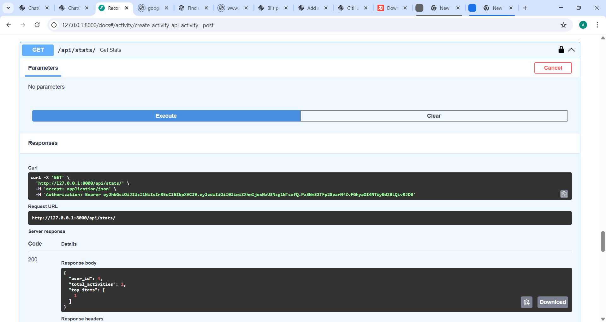
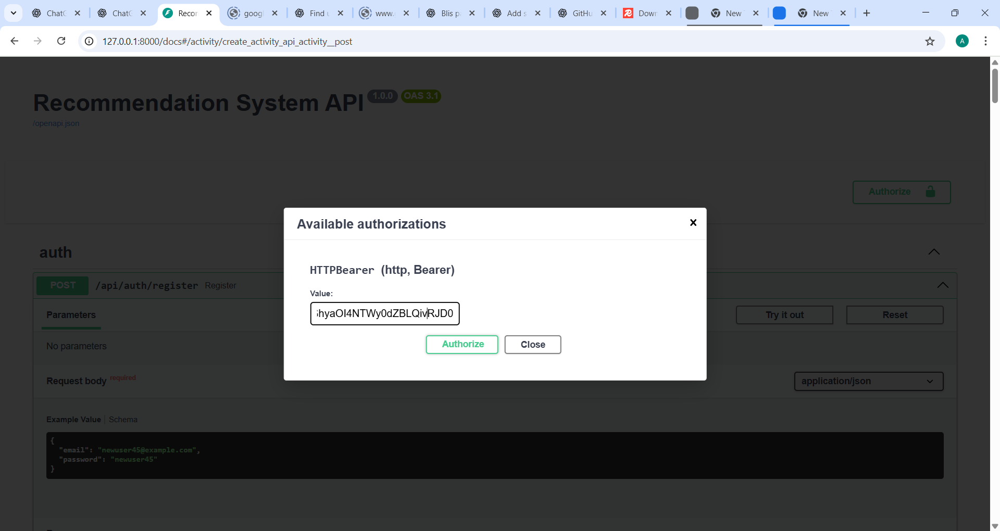
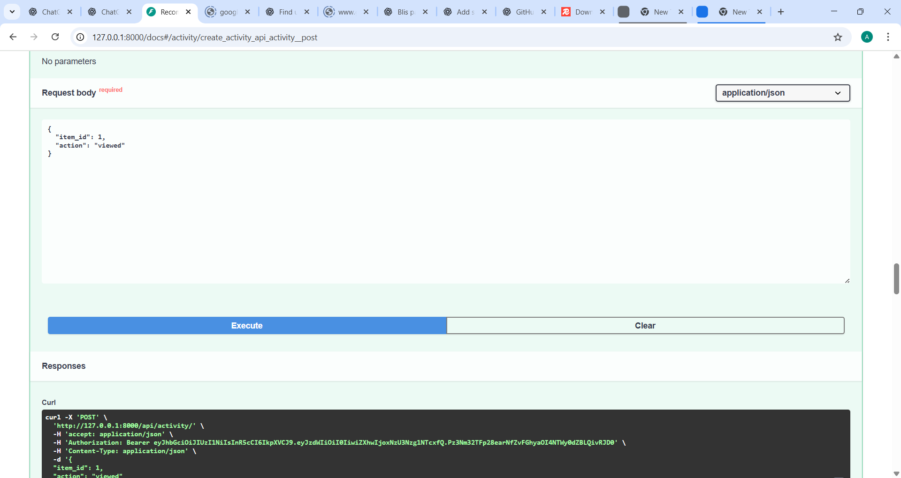
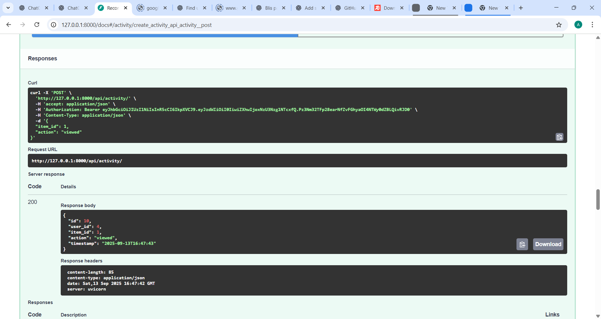

Recommendation System API

High-performance FastAPI backend with Redis caching (50% DB load reduction, 30% infra cost savings).  

🔥 50% DB load reduction with 30% cost optimization via Redis caching with cache invalidation
🔒 Secured JWT auth for user registration, login, and protected endpoints
📊 Track users' activity and serve real-time stats + personalized recommendations
🚀 Fully async, high-performance API with autogenerated Swagger docs
⚙️ Easy local setup with SQLite, migrations, and seed data

Can be scaled up easily by adding most frequent and recommended products with cache refreshing every 2–3 minutes.

🧰 Tech Stack

Python 3.11 | FastAPI | PostgreSQL (async SQLAlchemy) | Redis (async caching) | JWT Auth | dotenv

🗂️ Project Structure
.
├── app/
│   ├── main.py
│   ├── models/
│   ├── routers/
│   ├── services/
│   └── cache/
|   ├── seed.py/
|   ├── migrate.py/
├── requirement.txt
└── README.md

⚙️ Key Features

✅ JWT-based secure authentication (/api/auth/register, /api/auth/login, /api/auth/me)

📊 Activity tracking via /api/activity/

📈 User stats and recommendations via /api/stats/ (includes all stats with date, time, and user ID)

⚡ Redis caching with TTL & dirty flag for efficient invalidation

🧾 Swagger UI docs at /docs for interactive testing

🧊 Redis Cache Impact

Cache hits reduce DB queries by 50%+

Monitor Redis metrics: keyspace_hits, keyspace_misses, used_memory_human

Use RedisInsight or CLI (redis-cli info stats) for live cache stats

💰 Cost Efficiency with Redis Caching

Offloads frequent reads to Redis, reducing DB load by over 50%

Saves server CPU and I/O costs by reducing pressure on database

Smart cache invalidation ensures freshness without expensive full rebuilds

🔄 Sample API Request

POST /api/activity/

curl -X POST http://localhost:8000/api/activity/ \
 -H "Authorization: Bearer <your_token>" \
 -H "Content-Type: application/json" \
 -d '{"item_id": 4, "action": "purchased"}'

🚀 How to Run Locally
git clone https://github.com/yourusername/recommendation-system-api.git
cd recommendation-system-api

python3.11 -m venv venv
source venv/bin/activate  # On Windows: venv\Scripts\activate

pip install -r requirement.txt
python migrate.py
python seed.py
uvicorn app.main:app --reload

🔗 API Documentation

Open http://localhost:8000/docs
 to explore and test the API using Swagger UI.

📸 Screenshots

Redis cache stats(hits and miss cache)

Recommended items 

Authorization bearer token(registering and login with email and password for a new user)

Users create activity(by entering item id and action)

Succesfull activity created 

🚀 How to Run Locally
git clone https://github.com/yourusername/recommendation-system-api.git
cd recommendation-system-api
python3.11 -m venv venv
source venv/bin/activate  # On Windows use: venv\Scripts\activate
pip install -r requirement.txt
python migrate.py
python seed.py
uvicorn app.main:app --reload

🔗 API Documentation
Open http://localhost:8000/docs
 in your browser to explore and test the API using Swagger UI.

Open http://localhost:8000/docs
 in your browser to explore and test the API using Swagger UI.

