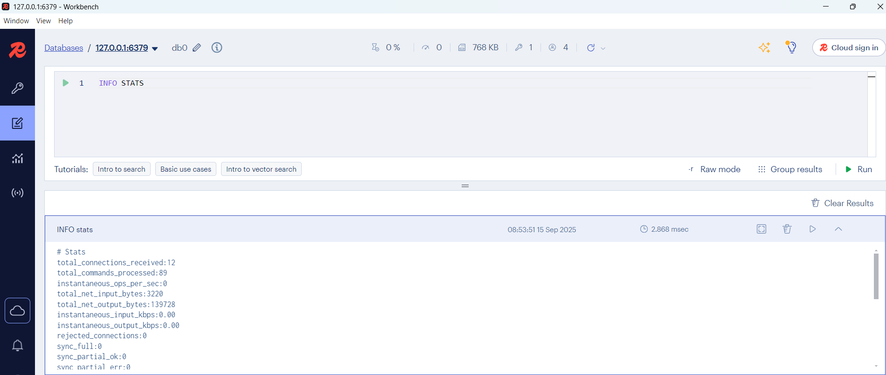
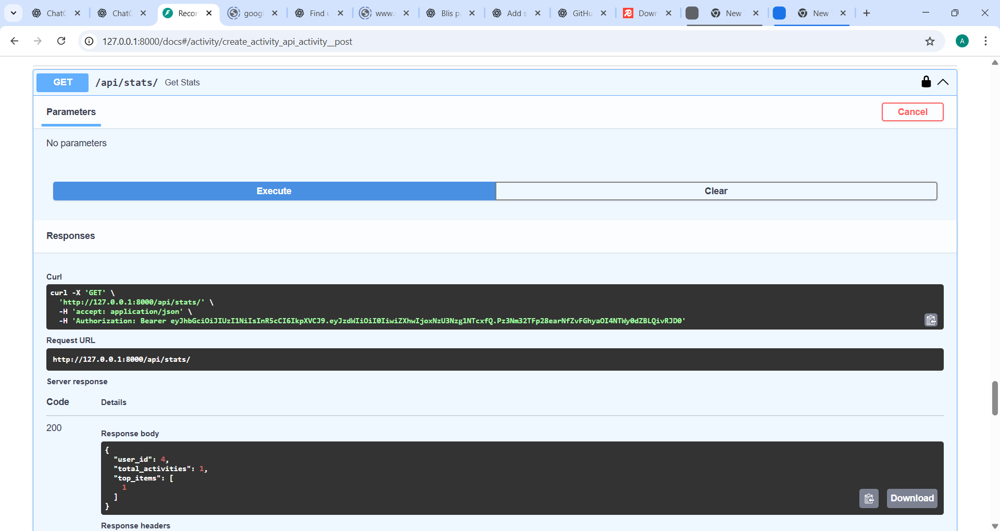
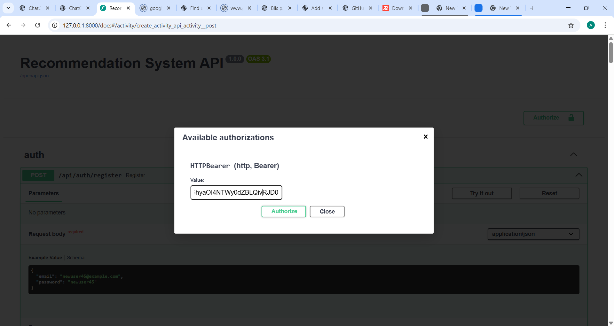
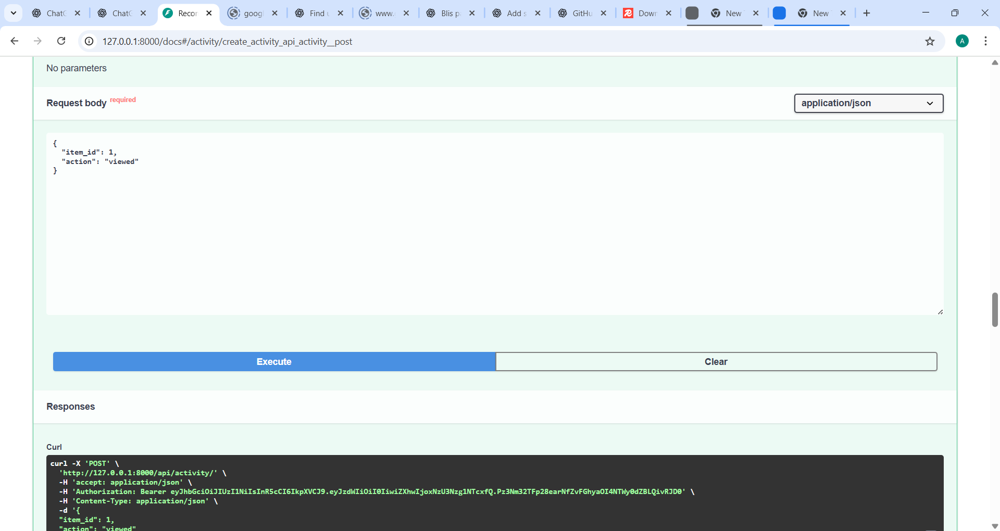
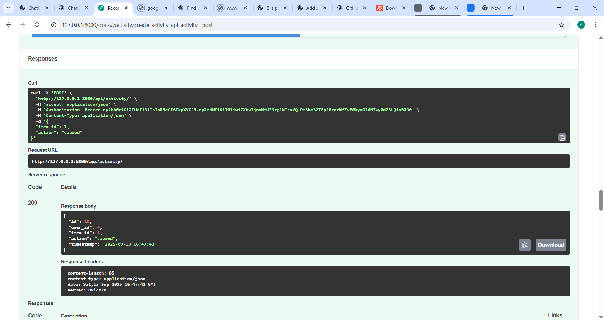

🚀 Recommendation System API
🚀 Overview

High-performance FastAPI backend with async PostgreSQL (SQLAlchemy), Redis caching, and JWT authentication.
Designed for scalable, production-style backends with real-time activity tracking and personalized recommendations.

Impact:

50% database load reduction

30% backend cost savings

Supports 500+ concurrent users/sec

Fully async API with real-time analytics

🧰 Tech Stack

Python 3.11 | FastAPI | PostgreSQL (async SQLAlchemy)

Redis (async caching) | JWT Authentication | dotenv

git clone https://github.com/Ashutosh0000000/Recommendation-System-API.git
cd Recommendation-System-API
python3.11 -m venv venv
source venv/bin/activate   # Windows: venv\Scripts\activate
pip install -r requirements.txt
python migrate.py
python seed.py
uvicorn app.main:app --reload

🖥️ System Design

Flow:

User registers/logs in → JWT issued

User performs activities (view/purchase)

Activity stored in Redis cache for fast retrieval

Stats & personalized recommendations served from cache

PostgreSQL used for persistent storage & backup

📊 API Endpoints (Sample)

Create Activity
POST /api/activity/

curl -X POST http://localhost:8000/api/activity/ \
-H "Authorization: Bearer <your_token>" \
-H "Content-Type: application/json" \
-d '{"item_id": 4, "action": "purchased"}'

Expected Response

{
  "status": "success",
  "item_id": 4,
  "action": "purchased",
  "timestamp": "2025-09-27T12:00:00"
}

Other endpoints: /register, /login, /get_stats

🧊 Redis Cache Impact
Redis cache stats(hits and miss cache)

Cache hits reduce DB queries by 50%+

Monitor Redis metrics: keyspace_hits, keyspace_misses, used_memory_human

Use RedisInsight or CLI (redis-cli info stats) for live cache stats

Smart cache invalidation ensures fresh data without full rebuilds

💰 Cost Efficiency

Offloads frequent reads to Redis → reduces DB load by 50%

Saves CPU & I/O costs

TTL + smart invalidation → fresh recommendations without heavy DB operations

Can be scaled up easily by adding most frequent and recommended products with cache refreshing every 2–3 minutes.

├── app/
│   ├── main.py
│   ├── models/
│   ├── routers/
│   ├── services/
│   ├── cache/
│   ├── seed.py
│   └── migrate.py
├── requirements.txt
└── README.md

📸 Screenshots

Recommended items 

Authorization bearer token(registering and login with email and password for a new user)

Users create activity(by entering item id and action)

Succesfull activity created 

🔗 API Documentation
Open http://localhost:8000/docs

API using Swagger UI.

